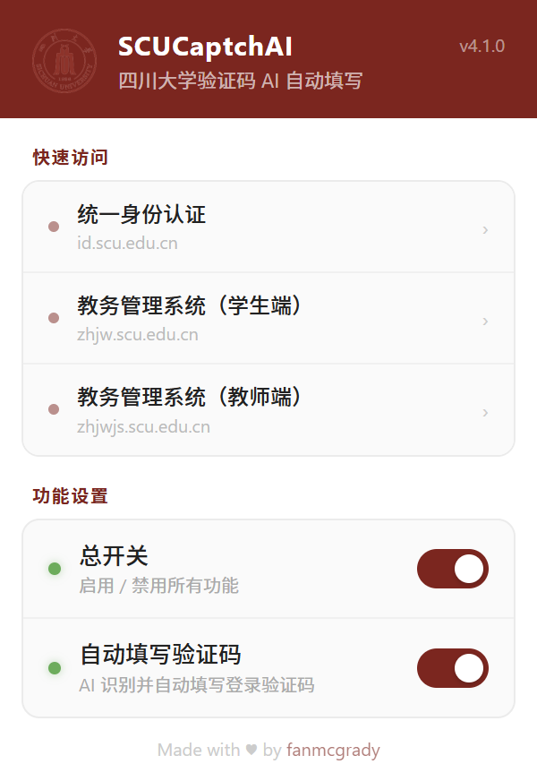

# SCUCaptchAI

四川大学网站验证码 AI 自动识别填写插件。

  

## 支持网站

| 网站 | 地址 |
|------|------|
| 统一身份认证 | id.scu.edu.cn |
| WebVPN 门户 | webvpn.scu.edu.cn |
| 教务管理系统（学生端） | zhjw.scu.edu.cn |
| 教务管理系统（教师端） | zhjwjs.scu.edu.cn |

## 功能

- 自动识别并填写登录验证码，无需手动输入
- 验证码图片刷新后自动重新识别
- 支持 WebVPN 代理访问
- 可通过插件弹窗随时开关功能

## 安装方法

由于插件暂未上架商店，请按以下步骤本地加载：

### Chrome / Edge

1. 下载本项目源码并解压
2. 打开浏览器，地址栏输入：
   - Chrome：`chrome://extensions`
   - Edge：`edge://extensions`
3. 开启右上角的 **开发者模式**
4. 点击 **加载已解压的扩展程序**
5. 选择本项目文件夹
6. 安装完成，访问支持的网站即可自动识别验证码

## 为什么没上架商店？

注册 Microsoft Edge 开发者账户时遇到错误（Error code 2931），暂时无法发布。后续解决后会上架。

## 作者

[fanmcgrady](https://github.com/fanmcgrady)
